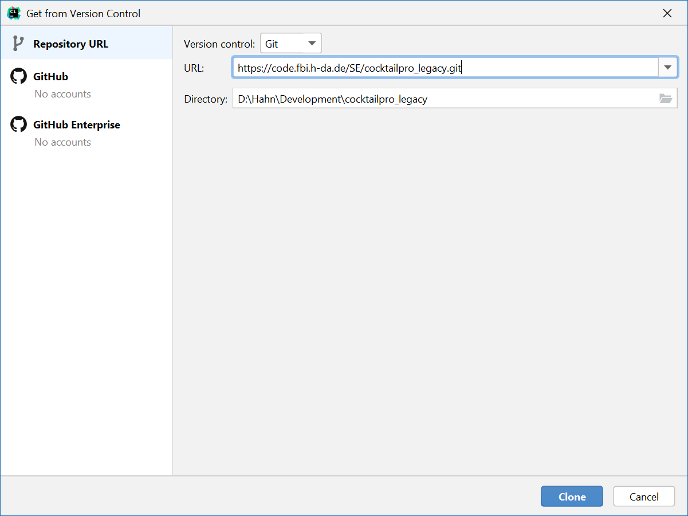
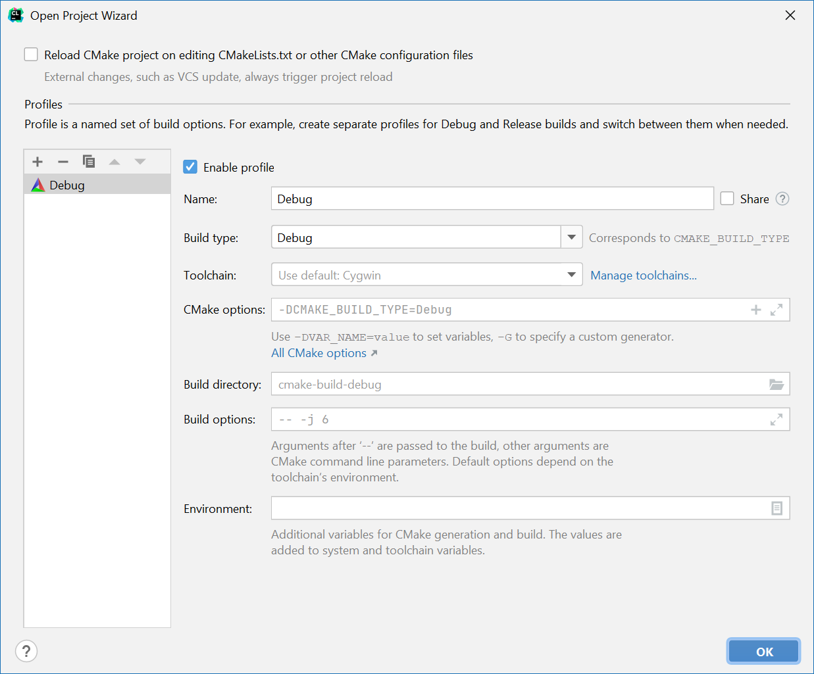

# Test Text fuer Aufgabe 1.2.2

# CocktailPro Legacy 
//Comment for Aufgabe 1.2.2
Im Jahr 2015 wurde eine Software zur Simulation eines Cocktail-Misch-Geräts entwickelt: der **"CocktailPro"**. Die Software wurde aber als Prototyp und nicht für einen dauerhaften Betrieb entwickelt. Deshalb enthält der Code praktisch keine Kommentare und leider auch keine sonstige Dokumentation. Auch kleinere Fehler sind bekannt, wurden aber nie behoben.
Nun soll die Software von Ihnen weiterentwickelt werden, allerdings so, dass die üblichen Qualitätsansprüche an eine "ernst gemeinte" Software erfüllt sind. 
Sie erhalten den vollständigen und kompilierbaren Code des CocktailPro's. 
Ihre Aufgabe im gesamten Praktikum besteht darin, das System wartbarer zu machen und um neue Funktionen zu erweitern.

### Voraussetzungen

Die Entwicklung des Codes erfolgt unter Verwendung von Git. In diesem Projekt verwenden wir Jenkins als Continuous Integration Server. Jenkins lädt Ihre Quellcode-Dateien automatisch aus Ihrem Git-Repository.
(Innerhalb des Hochschulnetzwerks können Sie den Jenkins-Server einfach aufrufen. Von außerhalb der Hochschule müssen Sie eine VPN-Verbindung verwenden.) 

Um die Software weiterentwickeln zu können, brauchen Sie entsprechende Software. Auf den Laborrechnern ist diese vorhanden, auf Ihrem Privatrechner müssen Sie die Software eventuell noch installieren

- **Git** (https://git-scm.com) und

- evtl. ein **grafischer Git-Client** (z.B. https://tortoisegit.org/)

- **VPN-Zugang** (Für den Zugriff auf Jenkins von außerhalb der Hochschule; Details unter https://its.h-da.io/infra-docs/docs/vpn.html)

- **Gnu-Compiler g++**, **make**, **gdb** und **cmake** (Für Windows Cygwin: https://www.cygwin.com/)

- **CLion** (https://www.jetbrains.com/clion/    
Auf den Laborrechnern verwenden Sie eine Hochschullizenz; für Ihren Privatrechner brauchen Sie eine (kostenlose) Lizenz für Studierende von Jetbrains. Dazu müssen Sie sich bei JetBrains registrieren.

## Entwicklung in CLion
Um das Projekt weiterentwickeln und Tests erstellen zu können, müssen Sie das Projektverzeichnis auf Ihren lokalen Rechner "clonen". Dazu verwenden wir die IDE "CLion" von Jetbrains. Öffnen Sie CLion, geben Sie bei erstmaligem öffnen Ihre Nutzerdaten ein und klicken Sie sich durch den Wizard. Klicken Sie anschließend auf **Get from VCS** und **Git** um ein Projekt von git zu clonen. Geben Sie dort die URL zum git Repository und den Speicherort des Projekts an (siehe Screenshot) und klicken Sie auf **klonen**. 

Anschließend werden Sie gefragt, ob Sie dem Projekt vertrauen, weil es eine Build-Datei (für Cmake) enthält. Klicken Sie auf **Trust Project**. Nun bestätigen Sie noch die Abfrage nach dem Profil mit **OK**. 

CLion erkennt dann automatisch die vorhandene Konfiguration Ihres Rechners und passt das Projekt entsprechend an. Nach einer Weile (erkennbar an dem Fortschrittsbalken unten rechts) können Sie das Projekt **CocktailPro** bauen und ausführen.

### Google Tests

Für das Ausführen der Google Tests in CLion aktivieren Sie die Konfiguration **CocktailProTest**. Wenn Sie nun diese Konfiguration bauen und ausführen, werden die Tests ausgeführt. Beim ersten Aufruf dauert es etwas länger, weil die Testbibliothek noch erzeugt werden muss. 

In der Standard-Einstellung werden nur gescheiterte Tests angezeigt. Deshalb muss man im unteren Bereich des Fensters genau hinschauen, um die Meldung **Tests passed...** zu entdecken. Klicken Sie etwas weiter links auf das Häkchen damit auch erfolgreiche Tests angezeigt werden. Nun sollten Sie alle durchgeführten Tests sehen.

Über die Konfiguration können Sie jetzt leicht wählen, ob Sie den ausführbaren CocktailPro oder die Google Tests übersetzen oder ausführen wollen. AUf Ihrem Recher brauchen Sie wahrscheinlich nur die Konfigurationen **CocktailPro** und **CocktailProTest**. Die übrigen Konfiguration lassen Sie bitte unverändert, weil Sie auf dem Buildserver verwendet werden.

## Viel Erfolg mit dem CocktailPro!

Ralf Hahn

Urs Andelfinger

Stefan T. Ruehl

Martin Girschick
